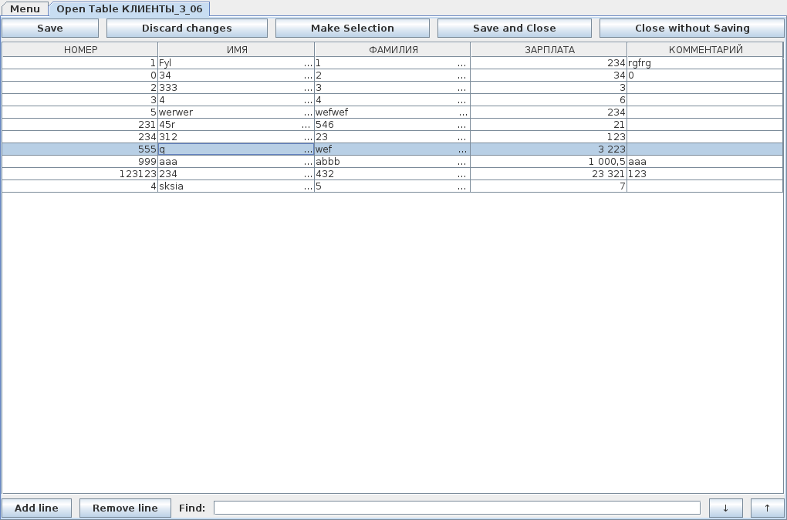

PSQL-Client
===========
Author: Andrey Nagorny

www: anagorny.com
 
GUI Interface for database (PostgreSQL)

======================================
VERSION 1.0
======================================

implemented:

1) Work with the base (basic operations with the table: add, open, delete);

2) Work with the table: (SELECT, UPDATE, INSERT, DELETE, sorting, preserving the sample to a new table)

3) interface: A login window, the added ability to save data to a file authentication without encryption (serialization).

In the following updates:

1) Improvement of working with the database, adding the ability to reconnect to the server in the event of communication problems.

2) Add the ability to create custom counters (for triggers and functions) and triggers.

3) Improved convenience and reliability of the interface.

4) Applet version of the client.

